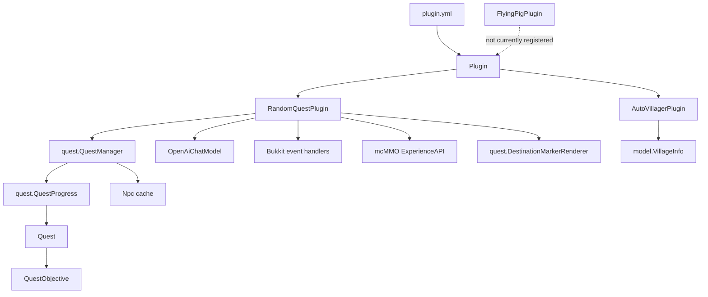
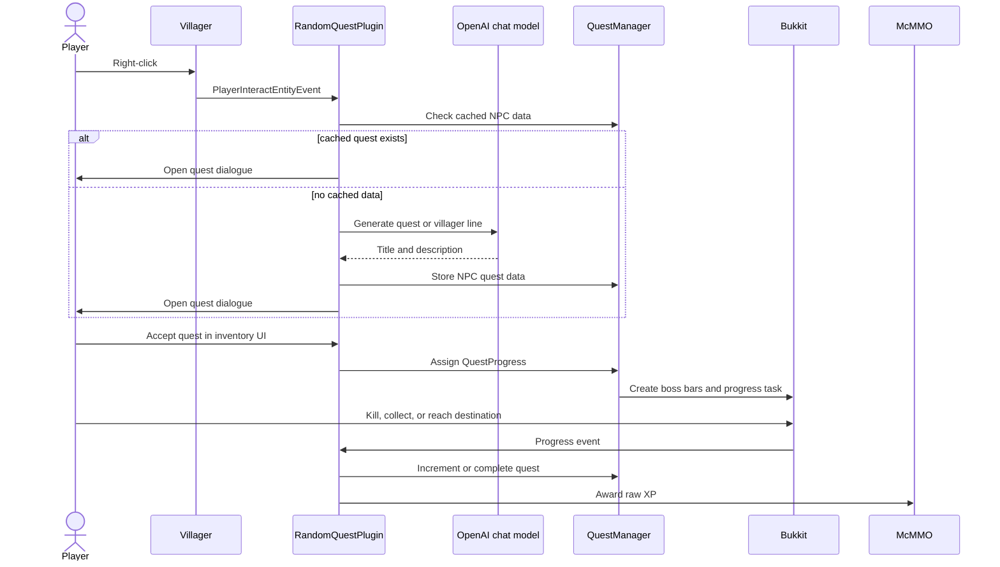
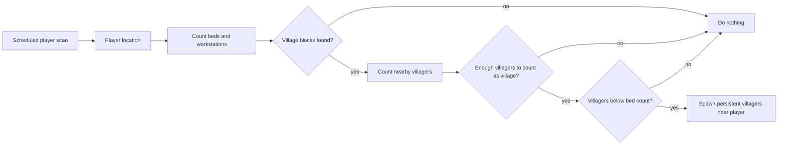

<p align="center">
	
</p>

# QuestAI

[](https://www.gnu.org/licenses/lgpl-3.0)

QuestAI is a Paper Minecraft server plugin that turns villagers into generated quest givers. It scans nearby villages,
keeps them populated, names villagers with AI-generated names, lets players accept generated quests through an inventory
dialogue, tracks quest progress, and rewards players with mcMMO XP.

The current implementation is intentionally small: one Bukkit entry point coordinates a few `SubPlugin` modules, while
the quest system is split across `RandomQuestPlugin` (event handlers and AI generation) and the `quest` package
(`QuestManager`, `QuestProgress`, `DestinationMarkerRenderer`).

## Features

- Repopulates villages around online players when there are fewer villagers than detected beds.
- Assigns generated names to villagers and persists the villager UUID-to-name mapping in `config.yml`.
- Generates short quest titles and descriptions through LangChain4j's OpenAI chat model.
- Supports `KILL`, `COLLECT`, `TREASURE`, and `FIND_NPC` quest objectives.
- Offers quests through a single-row inventory UI with accept and reject buttons.
- Tracks active quest progress with boss bars and event handlers.
- Rewards completed quests through the mcMMO `ExperienceAPI`.
- Includes optional experimental flying pig behavior, currently not wired into the root plugin.

## Architecture



### Runtime Modules

| Area | Main files | Responsibility |
| --- | --- | --- |
| Plugin entry point | `Plugin`, `plugin.yml` | Starts and stops the subplugins. |
| Village maintenance | `AutoVillagerPlugin`, `VillageInfo` | Detects nearby village blocks and spawns villagers up to bed count. |
| Quest system | `RandomQuestPlugin`, `QuestManager`, `QuestProgress`, `Quest`, `QuestObjective`, `Npc` | Generates dialogue and quests, opens the GUI, tracks progress, and grants rewards. |
| Map rendering | `DestinationMarkerRenderer` | Draws destination markers on quest maps for `TREASURE` and `FIND_NPC` quests. |
| Utility | `EnumUtil` | Random enum value selection. |
| Experimental content | `FlyingPigPlugin` | Floating pig behavior for new chunks; present but not enabled from `Plugin`. |

## Quest Flow



## Village Scan Flow



## Configuration

The plugin expects an OpenAI API key in the server-side plugin config:

```yaml
openai.api-key: "your-api-key"
```

`src/main/resources/config.yml` is ignored by Git in this repository. Keep real secrets out of commits and deployment
artifacts that should be shared. If a local `config.yml` exists when packaging, Maven can include it in the plugin jar
because the POM lists it as a resource.

## Testing

```bash
mvn test
```

Tests use JUnit 5 with Mockito to mock Bukkit server types. No live Minecraft server is needed.

## Build And Checks

Requirements:

- JDK 21 or newer
- Maven
- Paper API and mcMMO dependencies available through the configured Maven repositories

Useful commands:

```bash
mvn clean compile
mvn test
mvn pmd:check checkstyle:check
mvn package
```

The project uses:

- `pmd.xml` for PMD rules.
- `checkstyle.xml` for Checkstyle rules.
- `checkstyle-suppress.xml` for narrow Checkstyle XPath suppressions.

