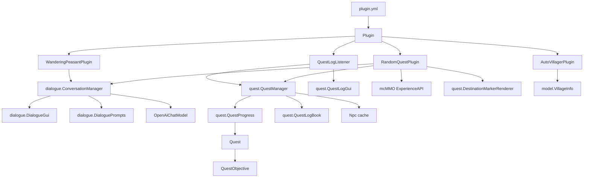
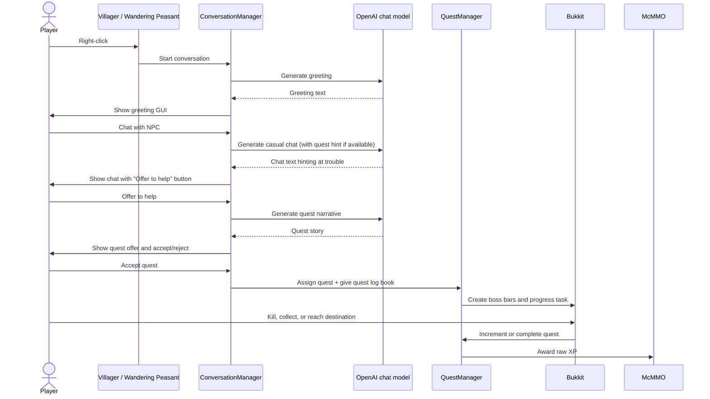
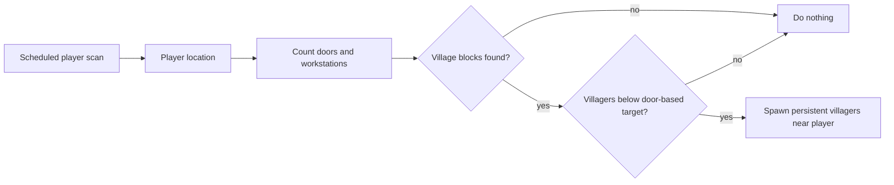

<p align="center">
	
</p>

# QuestAI

[](https://www.gnu.org/licenses/lgpl-3.0)

QuestAI is a Paper Minecraft server plugin that turns villagers and wandering peasants into AI-driven quest givers.
It scans nearby villages, keeps them populated, names every villager with AI-generated names, lets players discover
quests through natural conversation, tracks multiple quest progress simultaneously, and rewards players with mcMMO XP.

## Features

- Repopulates villages around online players when there are fewer villagers than detected beds.
- Assigns AI-generated names to villagers and persists the UUID-to-name mapping in `config.yml`.
- Conversational dialogue system with AI-driven NPC greetings, casual chat, and quest narratives.
- Quest discovery through organic NPC conversation — NPCs hint they need help rather than showing explicit quest buttons.
- Supports multiple concurrent quests per player with `KILL`, `COLLECT`, `TREASURE`, and `FIND_NPC` objectives.
- Interactive quest log book — right-click to view all active quests, drop to abandon all quests.
- Wandering peasant NPCs that roam the world and offer quests to players they encounter.
- Tracks quest progress with boss bars and event handlers.
- Rewards completed quests through the mcMMO `ExperienceAPI`.

## Architecture



### Runtime Modules

| Area | Main files | Responsibility |
| --- | --- | --- |
| Plugin entry point | `Plugin`, `plugin.yml` | Starts and stops the subplugins, registers the quest log listener. |
| Village maintenance | `AutoVillagerPlugin`, `VillageInfo` | Detects nearby village blocks and spawns villagers based on door count. |
| Dialogue system | `ConversationManager`, `ConversationState`, `ConversationPhase`, `DialogueGui`, `DialoguePrompts` | Manages NPC conversation flow, AI-driven dialogue, and inventory GUI screens. |
| Quest system | `RandomQuestPlugin`, `QuestManager`, `QuestProgress`, `Quest`, `QuestObjective`, `Npc` | Generates quests, tracks progress, handles completion, and grants rewards. |
| Quest log | `QuestLogBook`, `QuestLogGui`, `QuestLogListener` | Interactive quest log book item and GUI for viewing and abandoning quests. |
| Wandering peasants | `WanderingPeasantPlugin` | Spawns roaming quest NPCs using Wandering Trader entities. |
| Map rendering | `DestinationMarkerRenderer` | Draws destination markers on quest maps for `TREASURE` and `FIND_NPC` quests. |
| Quest generation | `QuestGenerationService` | Builds quests with random objectives and generates AI descriptions. |
| Utility | `EnumUtil` | Random enum value selection. |

## Quest Flow



## Quest Log

Players receive a **Quest Log** book when they accept their first quest. The book serves as
an interactive quest tracker:

- **Right-click** the book to open a GUI showing all active quests with progress, time remaining, and objectives.
- **Click an abandon button** below any quest to cancel it (spawned entities and items are cleaned up).
- **Drop the book** to abandon all active quests — the book evaporates and all quest-related entities are removed.

## Village Scan Flow



## Configuration

The plugin expects an OpenAI API key in the server-side plugin config:

```yaml
openai.api-key: "your-api-key"
```

`src/main/resources/config.yml` is ignored by Git in this repository. Keep real secrets out of commits and deployment
artifacts that should be shared. If a local `config.yml` exists when packaging, Maven can include it in the plugin jar
because the POM lists it as a resource.

## Testing

```bash
mvn test
```

Tests use JUnit 5 with Mockito to mock Bukkit server types. No live Minecraft server is needed.

## Build And Checks

Requirements:

- JDK 21 or newer
- Maven
- Paper API and mcMMO dependencies available through the configured Maven repositories

Useful commands:

```bash
mvn clean compile
mvn test
mvn pmd:check checkstyle:check
mvn package
```

The project uses:

- `pmd.xml` for PMD rules.
- `checkstyle.xml` for Checkstyle rules.
- `checkstyle-suppress.xml` for narrow Checkstyle XPath suppressions.
