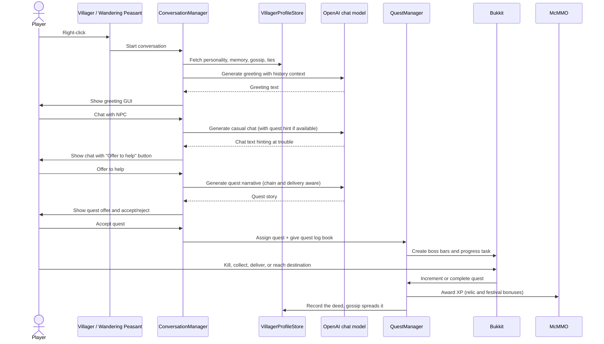
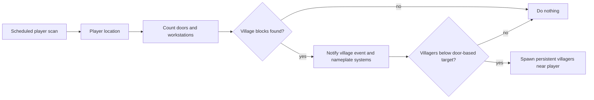

<p align="center">
	
</p>

# QuestAI

[](https://www.gnu.org/licenses/lgpl-3.0)

QuestAI is a Paper Minecraft server plugin that turns villagers and wandering peasants into AI-driven quest givers
with persistent personalities. It scans nearby villages and keeps them populated, gives every villager an
AI-generated name and personality, and lets players discover quests through natural conversation. Villagers
remember what each player has done for them, gossip about it to their neighbours, form kinships and rivalries
with each other, defend their homes during night raids, and pay out mcMMO XP, rare relics and other treasures.

The plugin runs on Minecraft 26.2 on Paper, builds against the 26.1.2 API and uses Java 25.

## Features

### Living villagers

- Assigns every villager an AI-generated name and personality in a single model call, persisted with the rest of
  the villager's profile in `villager-profiles.yml` (legacy name mappings in `config.yml` are migrated
  automatically).
- Per-player memory: villagers remember quests you completed, refused or accepted for them, parcels you carried
  and raids you helped break — and their dialogue reflects it.
- Gossip: villagers near each other exchange memories as hearsay, so a villager you have never met may already
  know your deeds. News travels even through unloaded chunks via stored villager locations.
- Relationships: villagers sharing a surname become kin automatically, and others bond as old friends or rivals
  over time. Ties colour dialogue and steer delivery quests toward family.
- Ambient life: cached greeting call-outs on the action bar as you pass, curious glances from villagers who only
  know you by rumour, and parcel hints when you approach a delivery recipient.
- Repopulates villages around online players based on detected doors and workstations.

### Quests

- Quest discovery through organic NPC conversation — NPCs hint they need help rather than showing explicit quest
  buttons, and their narratives are coloured by personality, shared history and village gossip.
- Five objective types: `KILL`, `COLLECT`, `TREASURE`, `FIND_NPC` and `DELIVERY` — deliveries carry a sealed
  package to another named villager, preferring the giver's kin and friends, with an in-character reaction on
  handover.
- Quest chains: completing a quest can open a short storyline of follow-ups from the same villager, with scaled
  rewards and a boosted relic chance on the finale.
- Supports multiple concurrent quests per player, tracked with boss bars, quest maps and a six-hour lifetime.
- Interactive quest log book — right-click to view all active quests, drop to abandon all quests.
- Rewards completed quests through the mcMMO `ExperienceAPI`, with festival and relic bonuses applied.

### Relics, events, mobs and the fallen star

- Five rare quest-exclusive relics with hand-drawn pixel-art sprites and light effects — bonus quest XP, better
  treasure, more quest offers, a villager-seeking compass and a peasant-summoning bell. Earned through a rare
  roll on quest completion or a treasure chest jackpot.
- Village events: night raids where named raider zombies converge on a village — break the raid and every
  villager present remembers and gossips about it — and rare daytime festivals granting a temporary quest-XP
  bonus.
- Custom mob variants forged from rare natural spawns: the towering **Gravehulk**, swarming knee-high
  **Gravelings** and the blaze-touched **Cinderling**, each with a tiny chance of dropping enchanted gear.
- Forged mobs sound like themselves. The Gravehulk growls an octave down with a ravager roar and a heartbeat
  under it, and thuds as it walks; Gravelings chitter an octave up. Ordinary zombies are untouched.
- Rats: harmless 3D-modelled vermin that scurry through caves — lit or dark — and around villages, squeak,
  never fight back even when struck, and drop cookable Rat Meat. Built from an invisible silverfish carrying
  a cube-built model from the pack, since vanilla clients cannot be given new entity geometry.
- Starfall: a very rare, visible night event — a star streaks across the sky and blasts a crater into natural
  terrain, guarded by Cinderlings and holding a glowing Star Fragment that villagers pay handsomely for.
- Wandering peasant NPCs that roam the world and offer quests to players they encounter.
- A themed resource pack is built at runtime and served over HTTP: scroll-banner dialogue GUI, custom buttons,
  relic and Star Fragment sprites — all generated pixel art, no bundled assets. The pack declares format range
  34-88 and emits item skins in both the legacy predicate format and the modern item definition format, so
  clients from 1.20.2 all the way to 26.2 render the sprites.

## Architecture


```mermaid
flowchart TD
	PluginYml[plugin.yml] --> Root[Plugin]
	Root --> AutoVillager[AutoVillagerPlugin]
	Root --> RandomQuest[RandomQuestPlugin]
	Root --> WanderingPeasant[WanderingPeasantPlugin]
	Root --> FlyingPig[FlyingPigPlugin]
	Root --> RelicListener[relic.RelicListener]
	Root --> MobForge[mob.MobForge]
	Root --> StarfallMgr[star.StarfallManager]
	Root --> EventMgr[event.VillageEventManager]
	Root --> QuestLogListener[quest.QuestLogListener]
	Root --> RPM[resourcepack.ResourcePackManager]

	AutoVillager -- village scan callback --> EventMgr
	StarfallMgr --> MobForge
	RPM --> TexGen[resourcepack.TextureGenerator]

	RandomQuest --> QM[quest.QuestManager]
	RandomQuest --> ConvMgr[dialogue.ConversationManager]
	RandomQuest --> PES[quest.PlacedEntityStore]
	RandomQuest --> Ambient[villager.AmbientGreetingTask]
	RandomQuest --> McMMO[mcMMO ExperienceAPI]
	WanderingPeasant --> ConvMgr
	RelicListener --> WanderingPeasant

	ConvMgr --> QGS[service.QuestGenerationService]
	ConvMgr --> DialogueGui[dialogue.DialogueGui]
	ConvMgr --> DialoguePrompts[dialogue.DialoguePrompts]
	ConvMgr --> OpenAI[OpenAiChatModel]

	ProfileStore[villager.VillagerProfileStore] --> Gossip[villager.GossipSpreader]
	ProfileStore --> Former[villager.RelationshipFormer]
	ProfileStore --> Summarizer[villager.MemorySummarizer]
	RandomQuest --> ProfileStore
	ConvMgr --> ProfileStore
	RelicListener --> ProfileStore
	EventMgr --> ProfileStore
	QGS --> Picker[service.DeliveryRecipientPicker]

	QM --> QP[quest.QuestProgress]
	QM --> QLB[quest.QuestLogBook]
	QM --> Npc[Npc cache]
	QP --> Quest[Quest]
	Quest --> Objective[QuestObjective]
	QuestLogListener --> QM
	QuestLogListener --> QLG[quest.QuestLogGui]
	RandomQuest --> DMR[quest.DestinationMarkerRenderer]
	AutoVillager --> VillageInfo[model.VillageInfo]
```

### Runtime Modules

| Area | Main files | Responsibility |
| --- | --- | --- |
| Plugin entry point | `Plugin`, `plugin.yml` | Wires the stores and subplugins, starts and stops them, registers listeners. |
| Village maintenance | `AutoVillagerPlugin`, `VillageInfo` | Detects villages by doors and workstations, spawns villagers, and feeds the village event system. |
| Villager profiles | `VillagerProfileStore`, `VillagerProfile`, `VillagerPersona`, `PlayerMemory`, `MemoryEvent`, `HearsayEvent`, `Relationship`, `ChainState`, `StoredLocation` | Persists names, personalities, locations, per-player memory, hearsay, ties and chain state in `villager-profiles.yml`. |
| Social simulation | `GossipSpreader`, `RelationshipFormer`, `MemorySummarizer`, `AmbientGreetingTask` | Spreads memories as hearsay, forms kinships and rivalries, condenses history into dialogue context, and shows ambient greetings. |
| Dialogue system | `ConversationManager`, `ConversationState`, `ConversationPhase`, `DialogueGui`, `DialoguePrompts` | Manages NPC conversation flow, AI-driven dialogue with injected memory context, and inventory GUI screens. |
| Quest system | `RandomQuestPlugin`, `QuestManager`, `QuestProgress`, `Quest`, `QuestObjective`, `QuestChains`, `Npc` | Generates quests, tracks progress, advances chains, handles completion, and grants rewards. |
| Quest generation | `QuestGenerationService`, `DeliveryRecipientPicker` | Builds quests with random objectives, picks delivery recipients (preferring ties), and generates AI descriptions. |
| Deliveries | `DeliveryPackage` | The sealed package item carried between villagers. |
| Quest log | `QuestLogBook`, `QuestLogGui`, `QuestLogListener` | Interactive quest log book item and GUI for viewing and abandoning quests. |
| Relics | `QuestRelic`, `RelicItems`, `RelicRoll`, `RelicEffects`, `RelicCooldowns`, `RelicCompass`, `RelicListener` | The rare relic set: identity, award rolls, passive boosts and right-click actives. |
| Village events | `VillageEventManager`, `VillageEvents`, `VillageKey`, `RaidState`, `FestivalState`, `VillageCheckListener` | Night raids and festivals triggered from the village scan. |
| Custom mobs | `MobForge`, `MobVariant`, `MobRoll`, `MobTags`, `MobDrops`, `GearItem`, `GearEnchant` | Forges Gravehulks, Graveling swarms and Cinderlings from natural spawns, with enchanted gear drops. |
| Starfall | `StarfallManager`, `Starfall`, `StarFragment` | The rare falling star: streak, crater, guarded fragment and the villager sell flow. |
| Resource pack | `ResourcePackManager`, `TextureGenerator` | Builds the themed pack at runtime (GUI sprites, relic and fragment art) and serves it over HTTP. |
| Wandering peasants | `WanderingPeasantPlugin` | Spawns roaming quest NPCs using Wandering Trader entities. |
| Map rendering | `DestinationMarkerRenderer` | Draws destination markers on quest maps for destination-based quests. |
| Placed entity safety | `PlacedEntityStore` | Persists quest-placed chests and hidden NPCs so orphans are swept after a crash. |
| Utility | `EnumUtil`, `AiChat`, `GuiItems` | Random picks, one-shot chat model calls, and GUI ItemStack building. |

## Quest Flow


```mermaid
sequenceDiagram
	actor Player
	participant NPC as Villager / Wandering Peasant
	participant ConvMgr as ConversationManager
	participant Profiles as VillagerProfileStore
	participant OpenAI as OpenAI chat model
	participant QuestManager
	participant Bukkit
	participant McMMO

	Player->>NPC: Right-click
	NPC->>ConvMgr: Start conversation
	ConvMgr->>Profiles: Fetch personality, memory, gossip, ties
	ConvMgr->>OpenAI: Generate greeting with history context
	OpenAI-->>ConvMgr: Greeting text
	ConvMgr->>Player: Show greeting GUI
	Player->>ConvMgr: Chat with NPC
	ConvMgr->>OpenAI: Generate casual chat (with quest hint if available)
	OpenAI-->>ConvMgr: Chat text hinting at trouble
	ConvMgr->>Player: Show chat with "Offer to help" button
	Player->>ConvMgr: Offer to help
	ConvMgr->>OpenAI: Generate quest narrative (chain and delivery aware)
	OpenAI-->>ConvMgr: Quest story
	ConvMgr->>Player: Show quest offer and accept/reject
	Player->>ConvMgr: Accept quest
	ConvMgr->>QuestManager: Assign quest + give quest log book
	QuestManager->>Bukkit: Create boss bars and progress task
	Player->>Bukkit: Kill, collect, deliver, or reach destination
	Bukkit->>QuestManager: Increment or complete quest
	QuestManager->>McMMO: Award XP (relic and festival bonuses)
	QuestManager->>Profiles: Record the deed, gossip spreads it
```

## Quest Log

Players receive a **Quest Log** book when they accept their first quest. The book serves as
an interactive quest tracker:

- **Right-click** the book to open a GUI showing all active quests with progress, time remaining, and objectives.
- **Click an abandon button** below any quest to cancel it (spawned entities and items are cleaned up).
- **Drop the book** to abandon all active quests — the book evaporates and all quest-related entities are removed.

## Village Scan Flow


```mermaid
flowchart LR
	PlayerTick[Scheduled player scan] --> Location[Player location]
	Location --> Blocks[Count doors and workstations]
	Blocks --> EnoughBlocks{Village blocks found?}
	EnoughBlocks -- no --> Stop[Do nothing]
	EnoughBlocks -- yes --> Events[Notify village event and nameplate systems]
	Events --> Spawn{Villagers below door-based target?}
	Spawn -- no --> Stop
	Spawn -- yes --> Create[Spawn persistent villagers near player]
```

## Village Names

Every village earns a name the first time someone walks into it, and a boss
bar carries that name for as long as the player stays inside. Step outside and
the bar goes away; a title could not do this, because a title fades on its own
timer rather than tracking where the player is.

The two halves run at very different speeds. Naming a village means surveying
tens of thousands of blocks, so it rides the existing five-minute sweep plus a
tightly throttled on-demand probe for villages nobody has visited yet. Deciding
whether a player is *inside* an already-named village is only a distance check
against a cached centre, so it runs every second and reads nothing.

Names come from the language model, seasoned with the biome and the size of the
settlement, and are kept forever once assigned. If the model cannot be reached
the village still gets a name derived from its own coordinates, so it is never
left anonymous and never retried in a loop.

Villages are matched by distance from a stored centre rather than by map cell.
A large village straddling a cell boundary would otherwise answer to two
different names depending on which half you were standing in.

## Mob Voices

A mob's sounds are chosen client-side from its **entity type**, so there is no
way to hand one zombie a different growl, and replacing `entity.zombie.ambient`
in a resource pack would change every zombie in the world. Forged mobs are
therefore silenced outright and given their voices back from the plugin.

That is all-or-nothing: silencing takes the hurt cry and the footsteps with it,
so a variant's voice has to cover everything it should still be heard doing.
`MobVoiceTest` guards against a gap, since a missing entry means silence rather
than a fallback.

Pitch is clamped by the client to 0.5-2.0, one octave either side of normal.
That is not much room, so the Gravehulk's weight comes from layering a ravager
roar and a warden heartbeat beneath the groan rather than from pitch alone. The
Graveling has an easier job going up.

Sounds are named by string rather than by the `Sound` enum, which keeps the
table free of registry-backed types and testable — and means a pack-supplied
`questai:` sound would be a data change rather than a rewrite. They play under
`SoundCategory.HOSTILE`, so a player's Hostile Creatures volume slider governs
them exactly as it would the vanilla growls they stand in for.

## Persistence

| File | Contents |
| --- | --- |
| `config.yml` | OpenAI API key and resource pack settings. |
| `villager-profiles.yml` | Villager names, personalities, locations, per-player memory, hearsay, relationships and chain state. |
| `village-names.yml` | The generated name and centre of every village discovered so far. |
| `placed-entities.yml` | Quest-placed chests and hidden NPCs, swept on startup after a crash. |
| `questai-pack.zip` | The generated resource pack, saved for debugging and manual hosting. |

## Configuration

The plugin expects an OpenAI API key in the server-side plugin config:

```yaml
openai.api-key: "your-api-key"
```

Optional resource pack settings (defaults shown):

```yaml
resourcepack:
  enabled: true
  port: 8163
  hostname: ""   # public IP or DNS name; auto-detected when empty
```

Optional village nameplate settings (defaults shown):

```yaml
villages:
  nameplate:
    enabled: true
    radius: 48.0   # how far from a village centre the name still shows
```

Optional rat settings (defaults shown):

```yaml
rats:
  enabled: true
```

`src/main/resources/config.yml` is ignored by Git in this repository. Keep real secrets out of commits and deployment
artifacts that should be shared. If a local `config.yml` exists when packaging, Maven can include it in the plugin jar
because the POM lists it as a resource.

## Testing

```bash
mvn test
```

Tests use JUnit 5 with Mockito to mock Bukkit server types. No live Minecraft server is needed. Registry-backed
Bukkit types (sounds, attributes, enchantments) cannot initialize off-server, so game logic is kept in pure,
fully-tested classes and only thin glue classes touch those registries.

## Build And Checks

Requirements:

- JDK 25 or newer — Paper 26.x ships Java 25 bytecode, so older JDKs cannot even compile against the API
- Maven
- Paper API and mcMMO dependencies available through the configured Maven repositories

The build resolves its JDK through Maven toolchains, so `~/.m2/toolchains.xml` must register a Java 25
installation:

```xml
<toolchains>
	<toolchain>
		<type>jdk</type>
		<provides>
			<version>25</version>
		</provides>
		<configuration>
			<jdkHome>/path/to/jdk-25</jdkHome>
		</configuration>
	</toolchain>
</toolchains>
```

The plugin builds against Minecraft 26.1.2 (Paper API `26.1.2.build.74-stable`, plugin
`api-version: '26.1'`) and runs on 26.2 servers, since the Paper API stays backwards compatible.
The compile target trails the newest release because MockBukkit, which backs the GUI tests, ships
one artifact per Minecraft version and has not published one beyond 26.1.2. Raising the API means
waiting for `mockbukkit-v26.2`; until then the older stable API keeps the GUI suite runnable.

Useful commands:

```bash
mvn clean compile
mvn test
mvn pmd:check checkstyle:check
mvn package
```

The project uses:

- `pmd.xml` for PMD rules.
- `checkstyle.xml` for Checkstyle rules.
- `checkstyle-suppress.xml` for narrow Checkstyle XPath suppressions.
